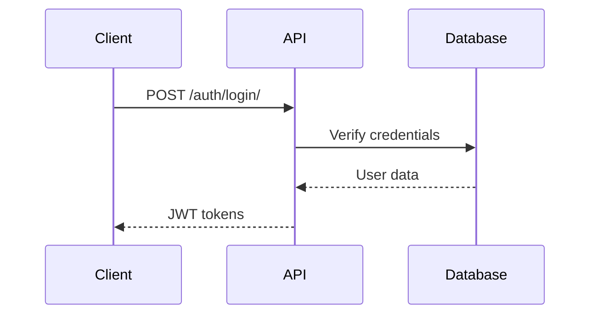
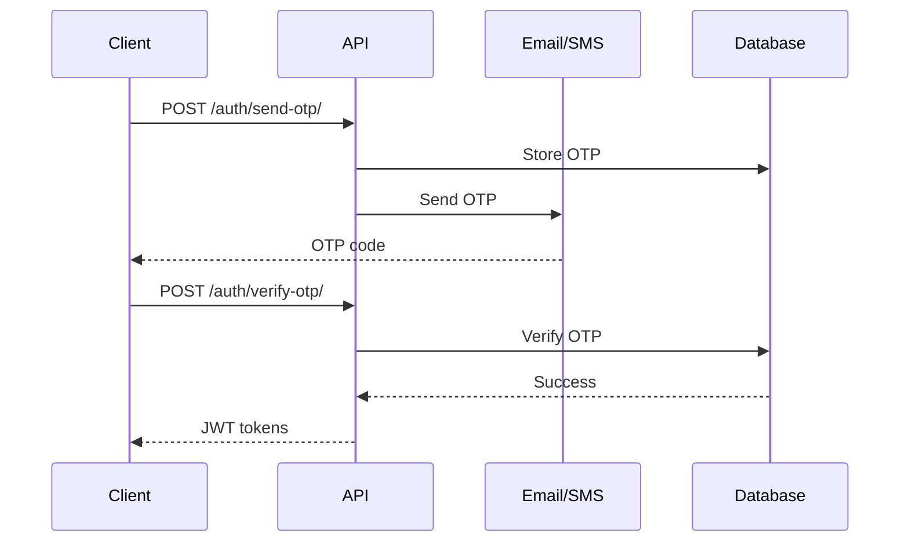

# مستندات API سیستم احراز هویت Istanbul Plus

## نمای کلی

این مجموعه مستندات شامل تمام اطلاعات لازم برای استفاده از API سیستم احراز هویت پیشرفته Istanbul Plus می‌باشد.

## فهرست مستندات

### 1. مستندات تعاملی (Interactive Documentation)

#### Swagger UI

- **آدرس**: `/api/docs/`
- **توضیح**: رابط تعاملی برای تست و بررسی API endpoints
- **ویژگی‌ها**:
  - تست مستقیم API ها
  - مشاهده request/response examples
  - احراز هویت آنلاین
  - دانلود OpenAPI schema

#### ReDoc

- **آدرس**: `/api/redoc/`
- **توضیح**: مستندات زیبا و خوانا برای API
- **ویژگی‌ها**:
  - طراحی responsive
  - جستجوی پیشرفته
  - نمایش کد examples
  - پشتیبانی از چندین زبان

#### OpenAPI Schema

- **آدرس**: `/api/schema/`
- **توضیح**: Schema خام JSON برای ابزارهای خارجی
- **استفاده**: SDK generation, testing tools

### 2. مستندات راهنما

#### راهنمای کاربری

- **فایل**: `USER_GUIDE.md`
- **محتوا**:
  - نحوه ثبت‌نام و ورود
  - استفاده از OTP
  - مدیریت پروفایل
  - تنظیمات امنیتی
  - عیب‌یابی مشکلات

#### راهنمای مهاجرت

- **فایل**: `MIGRATION_GUIDE.md`
- **محتوا**:
  - مراحل به‌روزرسانی
  - تغییرات مهم
  - اسکریپت‌های مهاجرت
  - عیب‌یابی مشکلات

#### چک‌لیست امنیتی

- **فایل**: `SECURITY_DEPLOYMENT_CHECKLIST.md`
- **محتوا**:
  - تنظیمات امنیتی
  - بهترین شیوه‌ها
  - تست‌های امنیتی
  - مانیتورینگ

### 3. مستندات فنی

#### API Reference

- **فایل**: `API_DOCUMENTATION.md`
- **محتوا**:
  - تمام endpoints
  - Request/Response schemas
  - Error codes
  - Rate limiting
  - Authentication

#### کد Examples

- **زبان‌ها**: JavaScript, Python, cURL
- **شامل**:
  - Authentication flow
  - OTP verification
  - Profile management
  - Error handling

## Quick Start

### 1. دسترسی به مستندات

```bash
# راه‌اندازی سرور توسعه
python manage.py runserver

# مراجعه به مستندات
# Swagger UI: http://localhost:8000/api/docs/
# ReDoc: http://localhost:8000/api/redoc/
```

### 2. احراز هویت

```javascript
// ثبت‌نام
const response = await fetch("/api/auth/register/", {
  method: "POST",
  headers: {
    "Content-Type": "application/json",
  },
  body: JSON.stringify({
    username: "john_doe",
    email: "john@example.com",
    password: "secure_password123",
  }),
});

const data = await response.json();
const accessToken = data.tokens.access;

// استفاده از token
const profileResponse = await fetch("/api/auth/profile/", {
  headers: {
    Authorization: `Bearer ${accessToken}`,
  },
});
```

### 3. OTP Verification

```python
import requests

# ارسال OTP
response = requests.post('/api/auth/send-otp/', json={
    'contact_info': 'user@example.com',
    'delivery_method': 'email',
    'purpose': 'login'
})

# تأیید OTP
response = requests.post('/api/auth/verify-otp/', json={
    'contact_info': 'user@example.com',
    'code': '123456',
    'purpose': 'login'
})

tokens = response.json()['tokens']
```

## API Endpoints خلاصه

### Authentication

- `POST /api/auth/register/` - ثبت‌نام
- `POST /api/auth/login/` - ورود
- `POST /api/auth/send-otp/` - ارسال OTP
- `POST /api/auth/verify-otp/` - تأیید OTP
- `POST /api/auth/logout/` - خروج
- `POST /api/auth/refresh/` - تجدید token

### Password Management

- `POST /api/auth/password-reset/request/` - درخواست بازیابی
- `POST /api/auth/password-reset/confirm/` - تأیید بازیابی
- `POST /api/auth/change-password/` - تغییر رمز

### Profile Management

- `GET /api/auth/profile/` - دریافت پروفایل
- `PUT /api/auth/profile/` - به‌روزرسانی پروفایل
- `POST /api/auth/profile/avatar/` - آپلود عکس

### Verification

- `POST /api/auth/verify-email/send/` - ارسال تأیید ایمیل
- `POST /api/auth/verify-email/confirm/` - تأیید ایمیل
- `POST /api/auth/verify-phone/send/` - ارسال تأیید موبایل
- `POST /api/auth/verify-phone/confirm/` - تأیید موبایل

### Session Management

- `GET /api/auth/sessions/` - لیست جلسات
- `DELETE /api/auth/sessions/{id}/` - حذف جلسه
- `POST /api/auth/logout-all/` - خروج از همه

## Error Handling

### Common Error Codes

| Code                  | Description          | HTTP Status |
| --------------------- | -------------------- | ----------- |
| `validation_error`    | خطای اعتبارسنجی      | 400         |
| `invalid_credentials` | اطلاعات ورود نامعتبر | 401         |
| `account_locked`      | حساب قفل شده         | 403         |
| `rate_limit_exceeded` | تجاوز از حد مجاز     | 429         |
| `invalid_otp`         | کد OTP نامعتبر       | 400         |
| `otp_expired`         | کد OTP منقضی         | 400         |

### Error Response Format

```json
{
  "error": {
    "code": "validation_error",
    "message": "Invalid input data",
    "details": {
      "email": ["Enter a valid email address."],
      "password": ["This field is required."]
    }
  }
}
```

## Rate Limiting

| Endpoint       | Limit | Window |
| -------------- | ----- | ------ |
| OTP requests   | 5     | 1 hour |
| Login attempts | 10    | 1 hour |
| Password reset | 3     | 1 hour |
| General API    | 1000  | 1 hour |

### Rate Limit Headers

```
X-RateLimit-Limit: 5
X-RateLimit-Remaining: 3
X-RateLimit-Reset: 1640995200
```

## Authentication Flow

### Standard Login



### OTP Login



## SDK و Libraries

### JavaScript/TypeScript

```bash
npm install @istanbulplus/api-client
```

### Python

```bash
pip install istanbulplus-api
```

### PHP

```bash
composer require istanbulplus/api-client
```

## Testing

### Postman Collection

- **فایل**: `Istanbul_Plus_API.postman_collection.json`
- **شامل**: تمام endpoints با examples

### Test Environment

```bash
# راه‌اندازی محیط تست
python manage.py test users.tests.test_api
```

## Support و Community

### پشتیبانی فنی

- **ایمیل**: api-support@istanbulplus.ir
- **تلفن**: +98 21 1234 5678
- **ساعات کاری**: شنبه تا چهارشنبه، 9-17

### منابع اضافی

- **GitHub**: https://github.com/istanbulplus/api
- **Stack Overflow**: tag `istanbulplus-api`
- **Discord**: https://discord.gg/istanbulplus

### Changelog

- **v1.0.0**: انتشار اولیه سیستم احراز هویت پیشرفته
- **تاریخ**: دی 1403

## License

این API تحت مجوز اختصاصی Istanbul Plus منتشر شده است.

**آخرین به‌روزرسانی**: دی 1403
